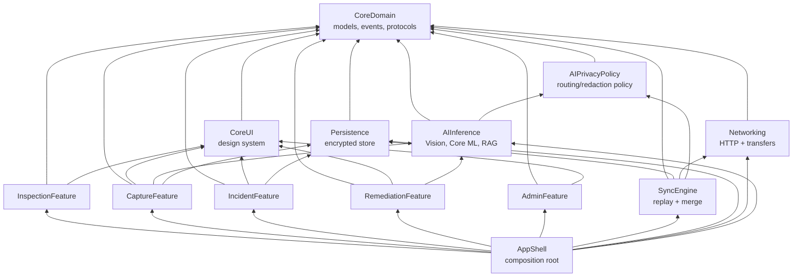
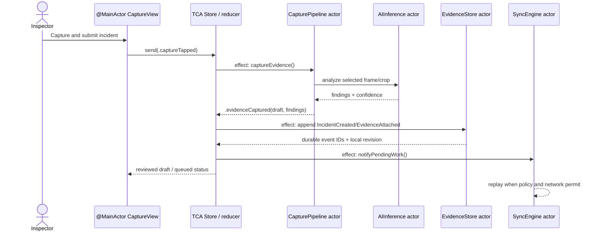

# SentinelOps Architecture

SentinelOps uses SwiftUI and The Composable Architecture (TCA) at the feature boundary, with Clean Architecture rules beneath it: domain types and protocols point inward; infrastructure implements them outward. Navigation is state, effects are explicit and cancellable, and every dependency has a live, preview, and deterministic test implementation.

## Package dependency rules

`CoreDomain` has no application dependencies and declares entities, commands, events, repository protocols, clocks, and policy interfaces. `CoreUI` is a design system only; it may render domain values but cannot initiate I/O. Features depend on contracts, not concrete databases or HTTP clients. `AppShell` is the only composition root and the only target permitted to import every feature.

Allowed arrows point from a consumer to a dependency. In particular, `CoreDomain` never imports SwiftUI, Vision, URLSession, SQLCipher, or TCA; `Persistence` never imports `Networking`; and no feature imports `AppShell` or another feature. The SPM package exposes `AppShell`, `CoreDomain`, `CoreUI`, `Persistence`, `Networking`, `SyncEngine`, `AIInference`, and `AIPrivacyPolicy`, plus the six feature targets. Tests may add test-support targets but must not weaken production dependency direction.

## State, navigation, and dependencies

Each feature has a `@Reducer` with `State`, `Action`, and `body`; its state owns `StackState`/presentation state for navigation. A reducer may synchronously validate a command, update optimistic UI state, and return an effect. It does not directly own a camera, database connection, or URL session.

Dependencies use TCA `DependencyKey`s backed by narrow `Sendable` clients: `CaptureClient`, `EvidenceStoreClient`, `IncidentRepositoryClient`, `SyncClient`, `PolicyClient`, `RAGClient`, `UUIDGenerator`, `DateGenerator`, and `ContinuousClock`. `AppShell` supplies live actor-backed clients. Preview values use fixtures. Tests use a `TestStore`, controllable clock, deterministic UUIDs, and in-memory event/evidence stores. This makes cancellation, retries, version stamps, and merge outcomes testable without global singletons.

## Concurrency boundaries

SwiftUI views, reducers, and UI-facing observable state run on `@MainActor`. They render snapshots and send actions; they do not hold actor-isolated mutable state. Long-running effects use structured concurrency and call `await` into engines. Each effect carries a cancellation ID tied to a screen/session, so dismissing Capture cancels transient analysis while preserving already committed evidence.

`CapturePipeline` is an actor that serializes capture-session state, frame admission, model lifecycle, ROI configuration, and task ownership. CPU/model work can execute in child tasks or framework-managed queues, but mutable pipeline state returns through the actor. A `TaskGroup` concurrently performs independent derivative work—thumbnail encoding, local analysis, encryption preparation—then commits a single consistent evidence result only if the session ID remains current. Child tasks check cancellation before expensive work and before writes.

`EvidenceStore` is an actor and the sole owner of database transactions, append-only event sequencing, encryption boundaries, and attachment metadata. Its APIs accept and return immutable `Sendable` values; transaction commits never require the main actor.

`SyncEngine` is an actor and the sole owner of replay cursors, in-flight idempotency keys, retry schedule, background-transfer reconciliation, and merge application. It publishes `AsyncStream<SyncStatus>` snapshots. A `@MainActor` effect consumes that stream and sends UI actions; the stream does not mutate feature state itself. Networking callbacks are bridged back into the actor before changing queue state.

## Lifecycle and observability

The app registers `BGProcessingTask`/`BGAppRefreshTask` requests in `AppShell`; the handler invokes `SyncEngine` with an expiration handler that cancels its structured task. Background `URLSession` completion events are handed to `Networking`, then reconciled through `SyncEngine` and `EvidenceStore`. `os_signpost` spans camera-to-inference, durable append, merge, retry, and upload phases; correlation IDs join those spans to an incident/event without logging plaintext evidence.

Architecture decisions are recorded in [ADR](ADR/). The pull-request quality gate is [`.github/workflows/ci.yml`](.github/workflows/ci.yml), which formats-checks Swift, runs tests, and validates model checksums.
