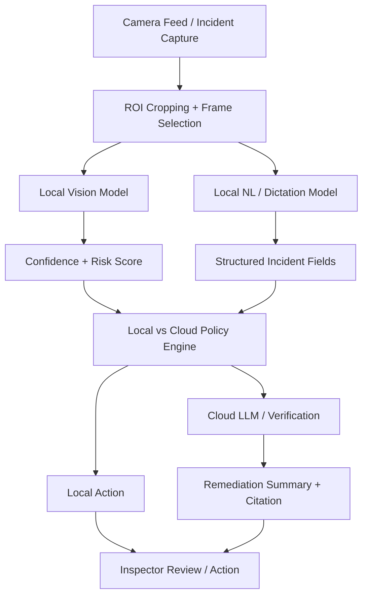
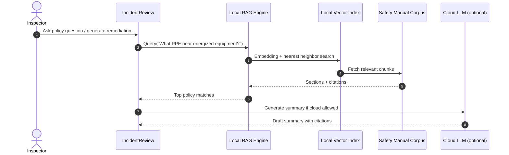

# SentinelOps Design: Edge AI / Cloud Hybrid Strategy

## 1. Goal

SentinelOps runs safety-focused AI at the edge where possible and escalates to cloud compute only when confidence, connectivity, risk, and privacy requirements justify it.

## 2. Architecture Overview



## 3. Local CoreML Pipeline

### Frame acquisition and throttling

Use frame throttling to preserve battery and device responsiveness:
- 5–10 fps for continuous scanning
- 1–2 fps under thermal warning
- full res for evidence capture events

### ROI cropping

Focus on relevant hazard zones such as:
- exit pathways
- loading docks
- conveyor belts
- PPE zones
- spill areas
- damaged equipment

### Model warm-up

Warm up on foreground entry or capture start to avoid cold-start latency spikes.

### Thermal throttling

Use `ProcessInfo.processInfo.thermalState` to reduce model intensity when the device overheats.

```swift
let thermalState = ProcessInfo.processInfo.thermalState
switch thermalState {
case .nominal:
    // full model / normal ROI
case .fair:
    // lower resolution, lower fps
case .serious:
    // use low-power model
case .critical:
    // pause non-essential inference
@unknown default:
    break
}
```

## 4. Local vs. Cloud Policy Engine

| Condition | Local Vision/NL | Cloud LLM / Fallback | Policy Notes |
|---|---|---|---|
| Battery > 35%, normal temp, confidence >= 0.75 | Yes | No | Local preferred |
| Battery 15–35%, confidence 0.40–0.75 | Yes | Maybe | Use local first |
| Battery < 15% or thermal serious | Restricted model only | No | Preserve power |
| Confidence < 0.40 and network available | No/partial review | Yes, redacted | Use cloud for uncertainties |
| High-risk incident + low confidence | Local review + alert | Yes | Human review required |
| Sensitive location / PII-heavy image | Local only | No | Zero retention |
| Offline | Yes | No | Local workflow only |

## 5. On-Device RAG Architecture

### Goal

Index safety manuals for offline natural-language retrieval.

### Retrieval flow



The system must cite:
- source manual
- chapter / section
- page number if available
- retrieval confidence

## 6. Summary

SentinelOps uses a hybrid AI model:
- local inference for speed, privacy, resilience
- policy-driven cloud routing for ambiguous or high-value cases
- local RAG for policy retrieval and citations
- strict redaction and zero-retention controls for remote transfers
