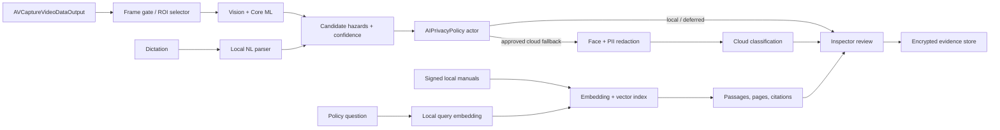
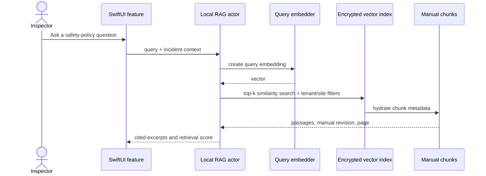

# SentinelOps Design: Edge AI / Cloud Hybrid

## Intent

Safety detection is useful only if it works with no signal, does not exhaust the device, and preserves evidence privacy. SentinelOps therefore treats on-device inference as the default. Cloud assistance is an explicitly approved, redacted exception; it never blocks incident capture or local policy retrieval.

## Local Core ML pipeline

`CapturePipeline` is an actor owning the camera-analysis lifecycle. Its capture delegate does as little work as possible: it admits a frame, creates an immutable pixel-buffer reference, and submits it to the actor. It never blocks the capture queue on inference or disk I/O.

| Concern | Nominal / fair | Serious | Critical |
|---|---|---|---|
| Scan cadence | 5–10 fps, adaptive to model latency | 1–2 fps | Stop continuous inference |
| Input | Model-native resolution and configured ROIs | Smaller ROI / lower resolution | Capture evidence only |
| Model | Primary detector and temporal smoother | Quantized or lightweight model | No nonessential model work |
| UI | Live suggestions | “Reduced analysis” state | Explain paused analysis and retain manual reporting |

Frame admission uses a monotonic clock and one in-flight inference token. Frames arriving sooner than the current interval, or while the pipeline is saturated, are dropped deliberately; the latest eligible frame wins. The interval is raised when p95 inference exceeds its budget and lowered only after sustained headroom. Evidence capture is independent of this gate and always records a requested full-quality image.

The ROI selector transforms normalized zones from the preview coordinate system into the correctly oriented image coordinate system. Default zones cover exits, traffic lanes, equipment guards, and configured PPE areas; model candidates can expand an ROI only after a bounded number of stable observations. Crop metadata (source image hash, normalized rectangle, orientation, model version) is persisted with every finding so later review is reproducible.

The app preloads the selected `VNCoreMLModel`, allocates reusable request handlers/buffers where APIs permit, and runs one low-priority warm-up request after foregrounding or opening Capture. Warm-up is cancellable, skipped in Low Power Mode, and never delays the camera. `ProcessInfo.processInfo.thermalState`, Low Power Mode, memory-pressure notifications, and battery state feed a quality controller. Memory pressure clears thumbnail/model caches first; it does not discard uncommitted evidence.

Results are temporally smoothed by tracking compatible labels and IoU-overlapping boxes across a short window. A finding is suggested only after a configurable persistence threshold, with high-severity classes allowed to alert sooner. The raw per-frame detections are ephemeral; reviewed findings and evidence are durable.

## Local versus cloud policy

The `AIPrivacyPolicy` actor makes a deterministic, auditable routing decision from a snapshot of confidence, risk, connectivity, thermal state, battery, data classification, tenant policy, and user approval. A cloud request is never an automatic upload merely because local confidence is low.

| Conditions | Route | Rationale |
|---|---|---|
| Offline, constrained path, captive portal, or no approved user action | Local or deferred | Preserve the offline workflow; do not queue imagery for implicit upload. |
| Sensitive site, legal hold, faces/PII that cannot be redacted, or tenant cloud disabled | Local only | Data policy overrides quality goals. |
| Battery below 15%, thermal `.serious`/`.critical`, Low Power Mode | Lightweight local / deferred | Protect the reporting session. |
| Confidence ≥ 0.75 and no high-risk ambiguity | Local result | Fast, private, explainable response. |
| 0.40–0.74 confidence | Local result marked for inspector review; optional cloud after approval | Human confirmation is primary. |
| Confidence < 0.40, network usable, redaction succeeds, and inspector approves | Redacted crop to cloud | Obtain a suggested classification only. |
| High-severity or contradictory signals | Present local evidence and require human review; cloud may be supplemental | No model makes a final safety determination. |

The request includes the minimum crop, a short-lived request token, policy-approved structured context, and a correlation ID—not the full incident, manual corpus, or unrelated photo library. The response is a suggestion with model/version provenance and expires according to the zero-retention policy in [SECURITY.md](SECURITY.md).

## On-device RAG

Safety manuals are imported as signed, versioned packages. An import job extracts text while preserving document ID, revision, section heading, page number, and checksum. It splits text on semantic boundaries with a small overlap, embeds each chunk using a bundled on-device embedding model, and stores vectors plus metadata in the encrypted local database/vector index. The model and corpus versions are part of every retrieval record.

Retrieval filters by tenant, jurisdiction, site, role, effective date, and manual revision before ranking. The UI displays source title, section, page, and revision for each answer; it does not present generated text as policy. Optional cloud drafting receives only user-approved cited excerpts after the same policy gate. Imports are atomic: a new index is built and checksum-verified before it replaces the active revision, so queries always see a coherent corpus.

## Operational controls

Instrument frame admission, ROI creation, inference, smoothing, RAG retrieval, redaction, and cloud-policy decisions with `os_signpost`; see [BENCHMARKS.md](BENCHMARKS.md). Signed model manifests pin model checksum, semantic version, supported hardware, and minimum app version. The app can disable a model/configuration from trusted server configuration, but never downloads executable code or an unverified model.

Related decisions: [ADR 0003](ADR/0003-edge-first-ai-routing.md) and [ADR 0004](ADR/0004-local-rag-citations.md).
