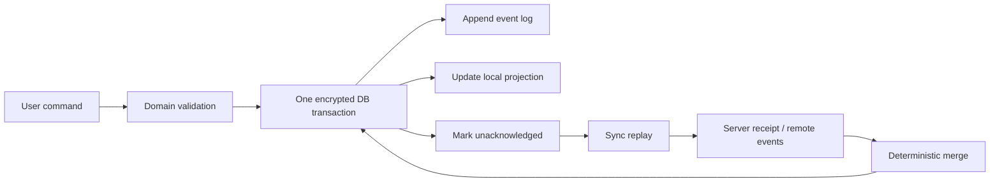

# Offline Sync

## Event-sourced offline engine

The local source of truth is an encrypted, append-only command log, not a mutable “pending upload” table. A user command first validates against the current local projection, then appends one or more immutable events in the same database transaction as the projection and attachment references. The UI acknowledges success only after this durable local commit; network availability is irrelevant to capture.

An event contains `eventID` (UUIDv7), aggregate/incident ID, actor/device ID, event kind, schema version, causal vector, UTC capture time, idempotency key, payload hash, and encrypted payload. Examples include `IncidentCreated`, `IssueFieldSet`, `EvidenceAttached`, `FindingReviewed`, `RemediationAssigned`, and `IncidentClosed`. Attachments use independent content hashes and transfer records, so an event can reference an item whose upload is still pending.

The projection is rebuildable from a checkpoint plus events. The outbox is a projection of locally authored/unacknowledged events, never a second authoritative log. A receipt checkpoint records the server cursor and acknowledgements transactionally. Replaying an event is safe because reducers are deterministic and commands/events are idempotent by ID and key. Schema upcasters read older event formats; events themselves are preserved for audit.

## Conflict resolution

Each incident maintains a version vector mapping replica ID to a monotonically increasing counter. Before a local write, the device increments its own counter and records the resulting vector on the event. The server validates event identity first, merges the received vector with its own component-wise maximum, and returns remote events/cursor. A compact server-issued replica identity prevents different installations from sharing a counter namespace.

For vectors `a` and `b`, `a` happens-before `b` when every component in `a` is `<=` the corresponding component in `b` and at least one is `<`; the newer event supersedes it. If neither happens-before the other, they are concurrent. Server revision is a convenience cursor for paging, not the conflict authority.

| Field type | Merge rule | Concurrent outcome |
|---|---|---|
| Incident/evidence IDs | Add-wins observed set | Both unique records survive. |
| Tags and participants | OR-set with add/remove dots | Preserves independent additions/removals. |
| Independent structured fields | Per-field vector/LWW register | Merge independently; no whole-record overwrite. |
| Scalar fields (severity, location) | Causal winner; concurrent values retained as conflict candidates | Deterministic tie-break (logical timestamp, actor ID, event ID) selects displayed value; UI exposes alternate/audit trail. |
| Notes | Immutable note events / RGA-style ordered blocks | Both offline edits remain; no text is silently lost. |
| Status transitions | Domain state machine plus vector | Close/reopen conflicts require policy-defined resolution and audit event. |

Ties are deterministic across devices, which guarantees convergence, but are not a claim that the winning value is semantically correct. Safety-critical conflicts flag the incident for supervisor review. Merge tests permute duplicate, reordered, and partitioned event streams and assert equal final projections, no duplicate attachments, and retained conflict evidence.

## Resumable background transfers

Small event batches use authenticated HTTPS with an `Idempotency-Key` header generated when the event is committed; retries reuse it forever. The service persists key-to-result mappings for at least the client retry horizon and returns the prior receipt for duplicate keys. Attachments use `URLSessionConfiguration.background(withIdentifier:)`, file-backed upload tasks, and persisted transfer metadata: event ID, content hash, task identifier, upload session/chunk offsets, retry count, and next eligible time.

The background session is recreated with the same stable identifier on launch. Delegate callbacks are routed to `Networking`, then `SyncEngine` atomically reconciles the task against the transfer record before marking the attachment acknowledged. Multipart/chunk uploads include per-part hashes and a final manifest hash; an interrupted task resumes from server-confirmed offsets rather than re-uploading the entire item. `application(_:handleEventsForBackgroundURLSession:completionHandler:)` is called only after all corresponding state is durably reconciled.

Retries apply capped exponential backoff with full jitter (for example, 1 s base, cap 30 min), honoring `Retry-After`, reachability changes, battery/thermal policy, and BackgroundTasks expiration. Retryable failures are timeouts, connection loss, 408, 429, and selected 5xx responses; authentication failure, checksum mismatch, and validation errors become actionable states rather than infinite retries. Transfers are constrained to policy-approved network types and require evidence encryption/redaction state to be valid before task creation.

## Network-chaos and recovery testing

The simulator-backed harness places a protocol-based transport (`URLProtocol` for foreground requests and a controllable transfer adapter for background-task seams) behind `NetworkingClient`. A seeded virtual clock and scripted server make faults reproducible; a test report includes the seed, event order, and observed state transitions.

| Fault | Harness behavior | Required assertion |
|---|---|---|
| Dropped packet / timeout | Drop request or response after server accepts it | Retry reuses the idempotency key; one server event and one local acknowledgement result. |
| Duplicate delivery | Replay a request and receipt | Reducer and server deduplicate by event/key. |
| Out-of-order responses | Delay selected responses and deliver a later cursor first | Cursor never moves backward; merge converges. |
| Partition / reconnect | Toggle reachability while events and attachments are queued | Local capture remains usable; replay drains after policy permits. |
| Process kill / background relaunch | Recreate actors/session from disk mid-transfer | Transfer records reconcile without lost or duplicated evidence. |
| Database corruption | Corrupt a copy of a page/WAL or inject store open failure | Integrity check quarantines the damaged store, restores last verified snapshot, replays valid log segments, and raises a support-safe alert. |

Corruption tests run only against disposable simulator fixtures. Production recovery never overwrites a suspect database: it preserves a forensic copy encrypted under the incident key, restores the last verified checkpoint, and replays checksum-valid events. If a required key or log segment cannot be verified, the app blocks sync for that dataset and requests supervised recovery rather than inventing records.

See [ADR 0001](ADR/0001-event-log-vector-conflicts.md) and the PR workflow [`.github/workflows/ci.yml`](.github/workflows/ci.yml).
